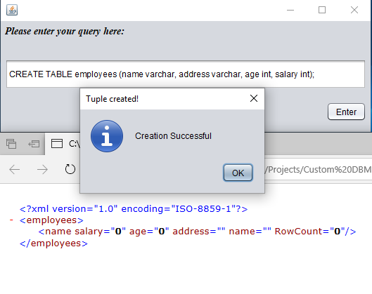
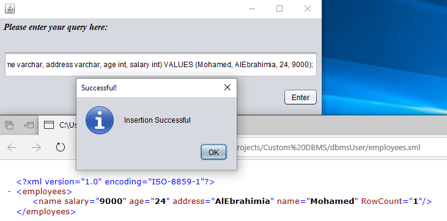
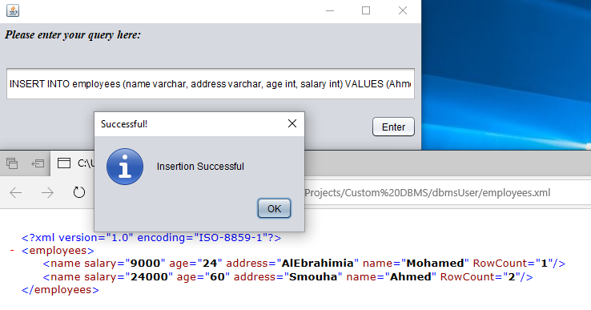
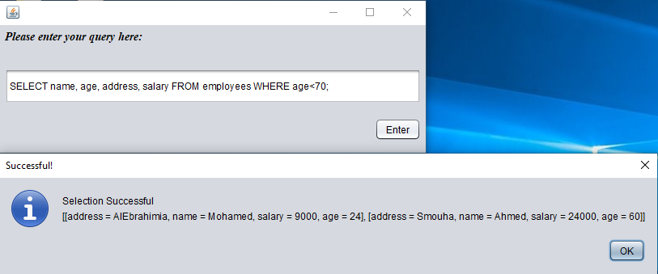
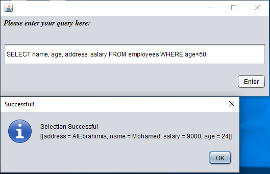
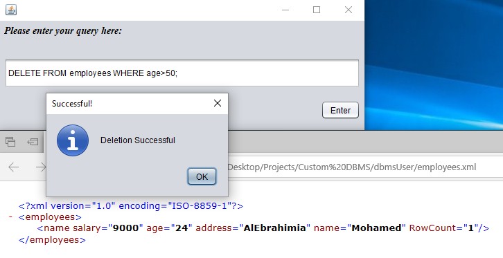
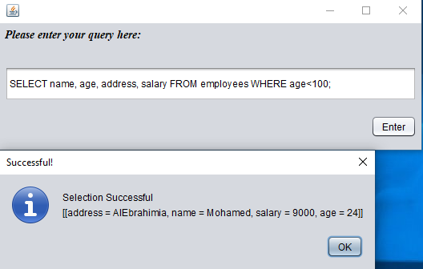
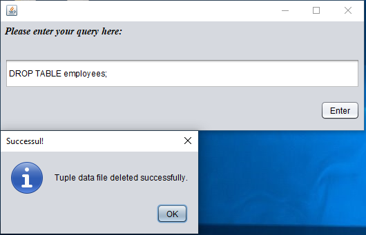
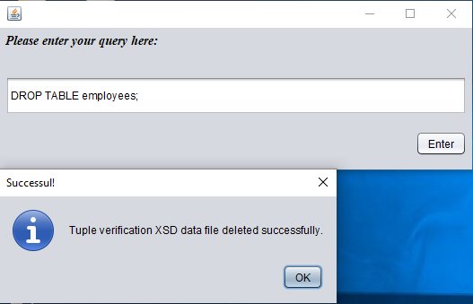

# Custom DBMS
- This project is about an implementation of a custom database management system.
- Was a noob at programming when I implemented this project.

**Features**

- Efficient parsing of database files using StAX parser.
- XSD validation over XML database files.

**Anti-features**

1- Perfect example of spaghetti code.
2- Lack of design patterns and OOP.
3- SQL queries are not flexible due limited usage of regular expressions.

**Example for acceptable queries:**

- CREATE TABLE employees (name varchar, age int);

- INSERT INTO employees (name varchar, age int) VALUES (Mohamed, 24);

- SELECT name, age FROM employees WHERE age < 30;

- DROP TABLE employees;

** Sample run**

- Creating table

- Inserting a new tuple

- Inserting another tuple

- Selecting tuples with age < 70

- Selecting tuples with age < 50

- Deleting tuples with age > 50

- Selecting tuples with age < 100

- Dropping the whole table

